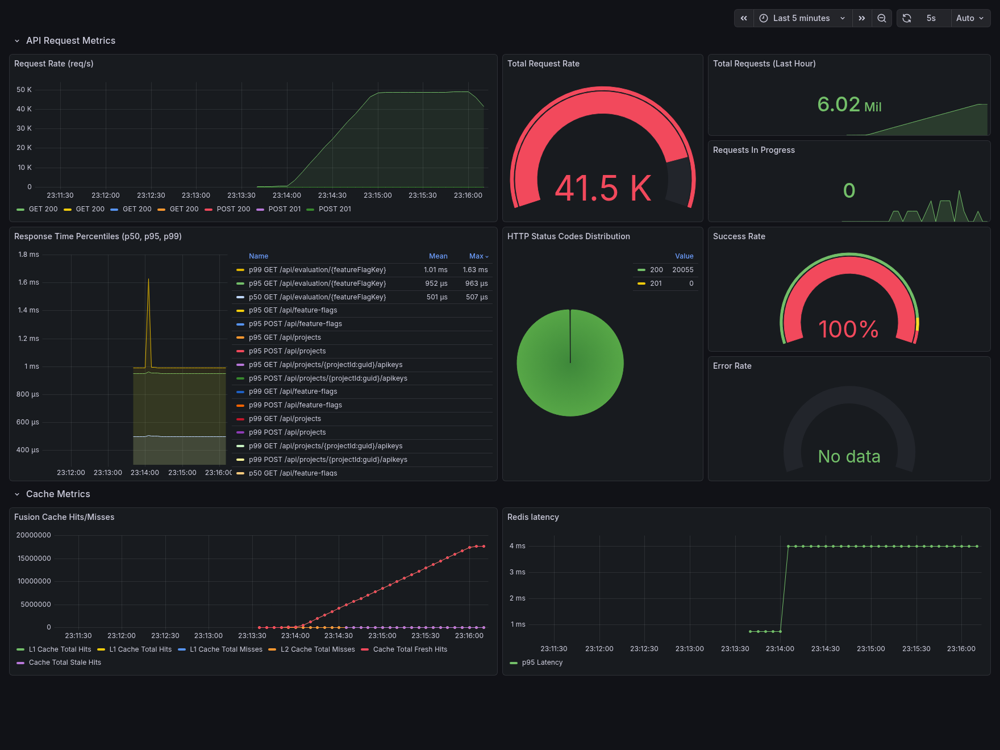
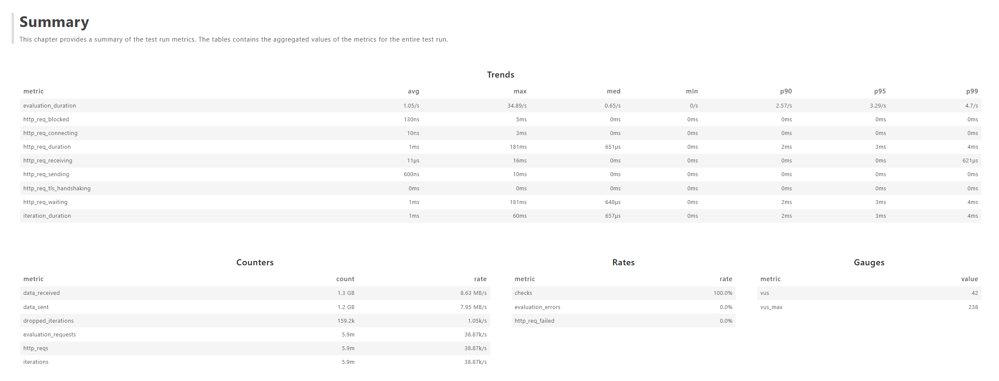
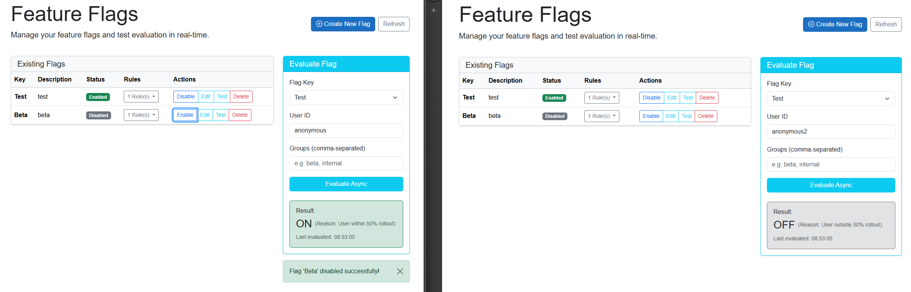
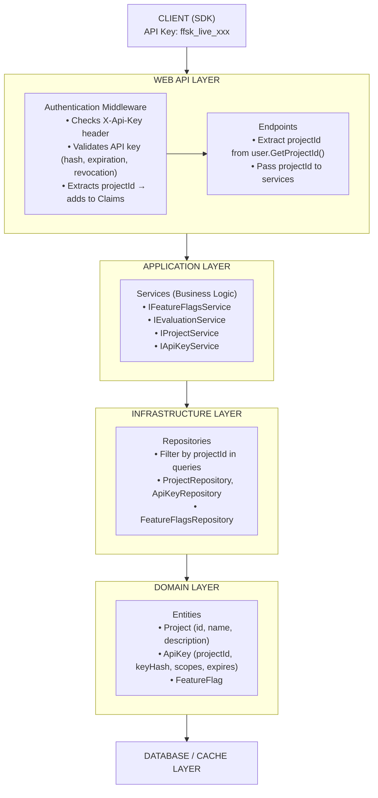

# Feature Flags Service

> Self-hosted, high-performance feature flag evaluation built on .NET 10.
> 50k RPS · <5ms p99 · 100% success rate · Client SDK · Real-time Blazor demo using SignalR · 79 tests passing




This README is documentation of a feature flags service that focuses on scalability and performance. This is a Proof of
Concept.

## Why this project?

Current feature flag services can cost upwards of £100+ per month at scale. This is a self-hostable alternative built to
demonstrate how .NET 10 can be used to build a high-performance feature flag service.

Built as a portfolio project to learn and explore:

- Zero-allocation hot paths using Span<T>, stackalloc and more efficient hashing methods
- Hybrid L1/L2 caching with eventual consistency guarantees using FusionCache
- Distributed systems patterns at high throughput
- SDK creation and usage - focusing on Developer Experience (DX)

## Performance

| Scenario   | RPS    | p99 Latency | Cache Hit Rate |
|------------|--------|-------------|----------------|
| Warm cache | 20,000 | 1.0ms       | 99.79%         |
| Warm cache | 50,000 | 4.7ms       | 99.79%         |

> These benchmarks reflect warm cache scenarios.
> See [LocalHostBenchmarks.md](docs/LocalHostBenchmarks.md) for full methodology, environment details, results and
> analysis.

## SDK & Demo

Client SDK (NuGet: `FeatureFlags.Client` and `FeatureFlags.Client.DependencyInjection`)
- Typed .NET client for flag evaluation and management of the entire service
- Built-in optional caching + retry logic
- See [Client SDK Usage](src/Clients/FeatureFlags.Client/README.md) for Client SDK documentation
- See [Client SDK DI Usage](src/Clients/FeatureFlags.Client.DependencyInjection/README.md) for Client SDK DI documentation

Blazor Demo App
- Real-time flag updates via SignalR
- Changes propagate to UI in <100ms
- See [Blazor Sample](samples/FeatureFlags.Sample.Blazor) for more details



## Architecture

The coding architecture will be based on the Clean Architecture principles, which separates the code into different
layers, such as the API layer, application layer, domain layer, and infrastructure layer. This will help with
maintainability and scalability of the codebase.



Tech stack:

- API: .NET 10 Minimal APIs
- Cache: FusionCache (L1 memory + L2 Redis) with Redis backplane
- Database: PostgreSQL
- Observability: Prometheus + Grafana
- Load testing: k6

See [ARCHITECTURE.md](docs/ARCHITECTURE.md) and [INFRASTRUCTURE.md](docs/INFRASTRUCTURE.md) for more details on clean
architecture breakdown and design decisions.

## Key Engineering Decisions

### Hashing

Profiling using PerfView and Speedscope revealed that SHA256 hashing was a significant bottleneck in the evaluation hot
path. At one point, load testing at 2k RPS/core showed 450% CPU usage in my API container, replacing it with XxHash32
and XxHash64 in places not needing cryptographic security immediately reduced that usage to 110% in the same scenario.

### Zero-Allocation Hot Paths

Evaluation logic allocates zero bytes per request:

- `ReadOnlySpan<char>` parsing instead of `string.Split()` for determing user groups
- `stackalloc` for cache key generation under 256 bytes, used in user bucketing as well
- ZString for zero-allocation string concatenation

### Caching

Feature flags and their rules are cached in L1 memory, as well as evaluation results. The Redis backplane is used to
synchronize cache updates across multiple API instances.
There are different cache configurations across each entity used in the service, these are defined in each repository.

**Quick Start:**

```bash
# Option 1: Infrastructure only (for local development)
docker-compose -f infrastructure/compose.localhost.yaml up -d
dotnet run --project src/Web.Api

# Option 2: Performance Baseline (Local API + Docker Infra)
# Use this to target <5ms p99 by avoiding Docker network overhead
docker-compose -f infrastructure/compose.localhost.yaml up -d
$env:ASPNETCORE_ENVIRONMENT="Production"
dotnet run --project src/Web.Api -c Release

# Option 3: Fully containerized (including API and Docker network load testing)
docker-compose -f infrastructure/compose.local.yaml --profile with-api --profile with-load-test up --build

# View monitoring
# Prometheus: http://localhost:9090
# Grafana: http://localhost:3000 (admin/admin)
# Metrics endpoint: http://localhost:5000/metrics

# Run load test
cd infrastructure
k6 run --out json=summary.json infrastructure/k6.evaluation.steady.js
or
k6 run --out json=summary.json infrastructure/k6.key-stress-test.js
```

Refer to [QUICKSTART.md](docs/QUICKSTART.md) for more details.

## Features

Main features:

- Feature flag CRUD operations with project-based multi-tenancy
- Real-time evaluation logic with user targeting and percentage rollout rules using bucketing
- Audit logs for all CRUD operations that happen in the background
- Cursor-based pagination
- Client SDK with DI support and optional in-memory caching for feature flag evaluations

Reliability:

- Fail-safe caching, it will serve stale data when Redis/Postgres are down
- Chaos testing using Chaos Monkey is verified (Redis and Postgres containers are killed randomly)
- ETag support for optimistic concurrency control

Observability:

- Grafana dashboard that shows cache (L1, L2) hit rate, evaluation latency, request rates, error rates and more
- Prometheus metrics endpoint
- OpenTelemetry tracing

## Project Status

The project is currently a production-ready PoC. All core features are implemented, and the service is designed to be
self-hosted in production environments.

### Known Issues

1. Evaluation caching: Currently caches full evaluation results - the user + flag. This trades consistency for
   throughput. Rule-only caching will be implemented instead.
2. Eventual consistency window needs to go up, a more bulletproof caching strategy needs to be implemented.
3. Rate limiting needs to be implemented.
4. Limited distributed load testing, more load testing scenarios and more load testing infrastructure are needed. Podman and kind will be used for local Kubernetes cluster testing.

## Testing

79 tests across the full solution including the API and Client SDK, all successful.

## Documentation

| Doc                                                   | What It Covers                                     |
|-------------------------------------------------------|----------------------------------------------------|
| [ARCHITECTURE.md](docs/ARCHITECTURE.md)               | Clean architecture, layer responsibilities         |
| [INFRASTRUCTURE.md](docs/INFRASTRUCTURE.md)           | Infrastructure choices, explanations and reasoning |
| [LocalHostBenchmarks.md](docs/LocalHostBenchmarks.md) | Full benchmark methodology + results               |
| [ETAG.md](docs/ETAG.md)                               | ETag implementation, optimistic concurrency        |
| [PAGINATION.md](docs/PAGINATION.md)                   | Cursor-based pagination design                     |

## Author

Adiv Asif · Software Engineer  
[LinkedIn](https://www.linkedin.com/in/asifadiv/)
## License
This project is licensed under the MIT License - see the [LICENSE](LICENSE) file for details.
