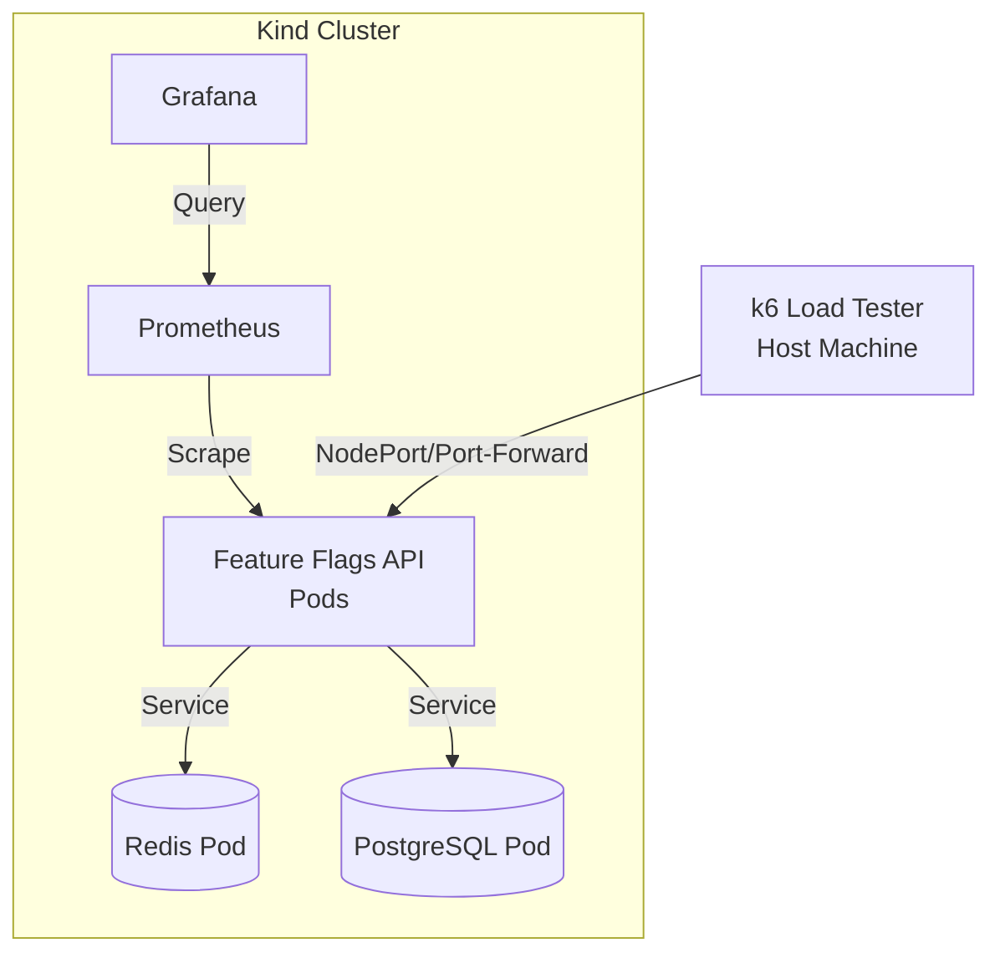

# Feature Flags API - Distributed Benchmark Documentation

## Stage 2: Distributed Cluster Benchmarks (Kind + Podman)

### Overview

This document describes the setup and execution of distributed benchmarks for the Feature Flags API using a Kind (
Kubernetes IN Docker/Podman) cluster.
These benchmarks move beyond local host testing to simulate a more realistic distributed environment.

### Prerequisites

- Podman (with WSL2 backend on Windows)
- Kind (Kubernetes in Docker/Podman)
- kubectl
- k6 (installed on the host)

### Environment Setup

#### 1. Create a Kind Cluster

If you don't have a cluster yet, create one. Ensure you use the `podman` provider.

```powershell
# Set Podman as the provider for Kind
$env:KIND_EXPERIMENTAL_PROVIDER="podman"

# Create a cluster with NodePort mappings if needed, 
# though we'll use 'kind load' for the image.
kind create cluster --name kind-cluster
```

#### 2. Build and Load the API Image

Build the API image locally and load it into the Kind cluster. Since Podman on Windows often prefixes images with
`localhost/`, I will use that naming convention consistently in both the build command and the Kubernetes manifest.

```powershell
# Ensure Podman provider is set for the current session
$env:KIND_EXPERIMENTAL_PROVIDER="podman"

# Build the image with a tag that matches the manifest
podman build -t localhost/feature-flags-api:latest -f infrastructure/Dockerfile .

# Load the image into Kind
# Note: If this fails, see the Troubleshooting section below
kind load docker-image localhost/feature-flags-api:latest --name kind-cluster
```

**Troubleshooting Image Load:**
If `kind load` still reports the image is not present locally (common with Podman on Windows):

1. Verify the image exists in podman: `podman images`
2. Try loading via a temporary archive (most reliable with Podman/WSL):
   ```powershell
   podman save -o feature-flags-api.tar localhost/feature-flags-api:latest
   kind load image-archive feature-flags-api.tar --name kind-cluster
   Remove-Item feature-flags-api.tar
   ```

#### 3. Deploy Infrastructure to Kubernetes

Deploy PostgreSQL, Redis, Prometheus, Grafana, and the API using the provided manifest.

```powershell
kubectl apply -f infrastructure/k8s/feature-flags-all.yaml
```

Wait for all pods to be ready:

```powershell
kubectl get pods -n feature-flags -w
```

### Running Benchmarks

The API is exposed via a NodePort on port `30080`. Since Kind runs inside Podman/Docker, you can access it via the
node's IP or by using `kubectl port-forward`.

#### Option A: Using Port-Forwarding (Simplest)

In a separate terminal:

```powershell
kubectl port-forward svc/api 8080:8080 -n feature-flags
```

Then run k6 from your host:

```powershell
$env:K6_WEB_DASHBOARD="true"
$env:K6_WEB_DASHBOARD_EXPORT="distributed-report.html"
k6 run --out json=distributed-summary.json -e BASE_URL=http://localhost:8080 infrastructure/k6.evaluation.steady.js
```

#### Option B: Accessing via NodePort (Kind specific)

If you want to avoid port-forwarding overhead:

1. Get the Kind node IP: `kubectl get nodes -o wide`
2. Use the NodePort `30080` with that IP.

```powershell
$KIND_IP = kubectl get nodes -o jsonpath='{.items[0].status.addresses[?(@.type=="InternalIP")].address}'
k6 run -e BASE_URL=http://$($KIND_IP):30080 infrastructure/k6.evaluation.steady.js
```

### Monitoring

The infrastructure manifest automatically provisions Prometheus with scrape targets and Grafana with pre-configured
datasources and dashboards.

- **Prometheus:** Accessible via NodePort `30090` or port-forward
  `kubectl port-forward svc/prometheus 9090:9090 -n feature-flags`.
- **Grafana:** Accessible via NodePort `30030` or port-forward
  `kubectl port-forward svc/grafana 3000:3000 -n feature-flags` (Default login: `admin`/`admin`).
    - The **"Feature Flags Service - Performance Dashboard"** is automatically loaded and ready for use.

### Cleanup

```powershell
kubectl delete -f infrastructure/k8s/feature-flags-all.yaml
# Or delete the whole cluster
# kind delete cluster --name kind-cluster
```

## Distributed Test Environment Architecture


