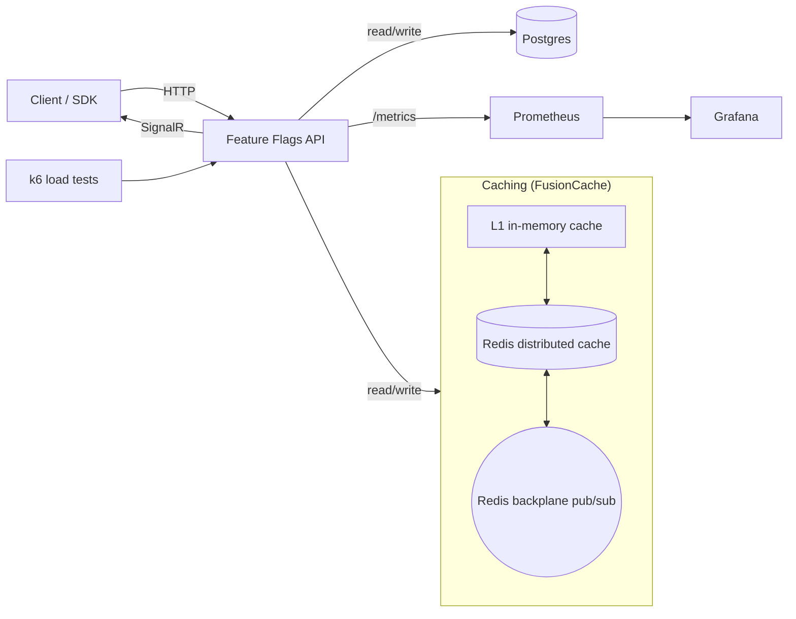
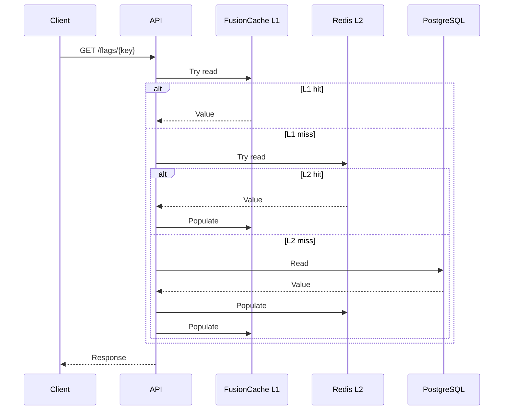
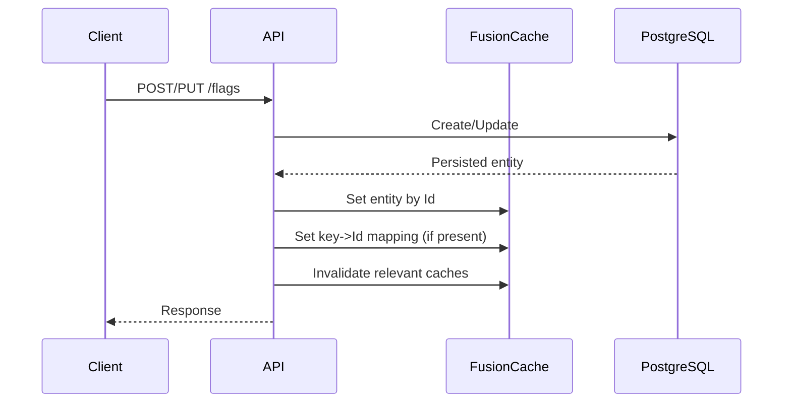

# Infrastructure

The infrastructure of this project is the highlight, in my opinion, and so, a deeper dive into its details is necessary
to understand how a feature flag service could work. A good infrastructure is the key to a more robust service,
and can improve correctness, consistency, and performance.

There are multiple components working together to provide a robust, scalable, and efficient feature flag service:

1. Database (Postgres)
2. Caching layer (FusionCache with Redis)
3. Cache backplane (Redis Pub/Sub)
4. Observability (Prometheus + Grafana)
5. Real-time updates to clients with SignalR
6. Load testing (k6)

Below is a diagram using Mermaid of the proposed infrastructure (using the Feature Flag API):

### How it works

- Reads are optimized for speed, writes are optimized for correctness, and observability tracks it all.
- Read path: the API checks FusionCache (L1 in-memory first, then Redis). On a miss, it reads from Postgres, returns the
  result, and populates the cache with a short TTL - this TTL depends heavily on the entity.
- Write path: create/update/delete operations persist to Postgres and then invalidate cache entries. The Redis
  backplane (pub/sub) broadcasts invalidation to other nodes so other API instances drop stale entries.
- Cache behavior: FusionCache uses fail-safe to serve slightly stale data when Redis or the database are
  slow/unavailable, with jitter to avoid cache stampedes and a circuit breaker to protect Redis.
- Data storage: Postgres is the source of truth; Redis is a performance layer only. EF Core migrations are applied at
  startup to keep the schema in sync.
- Observability: the API exposes `/metrics` via prometheus-net. Prometheus scrapes metrics and Grafana provides
  dashboards for latency, errors, and throughput.
- Local/prod setup: Docker Compose brings up the API, Postgres, Redis, Prometheus, Grafana, and optional k6 load tests
  using the same network. Local testing is documented in LocalHostBenchmarks.md, and works differently from a typical
  distributed cluster testing method.

## PostgreSQL Database

Treated as the source of truth. Everything else is in service of keeping this consistent and fast, trying to avoid
hitting the database as much as possible is a good practice.

This is a fairly basic database setup, with a table for Feature Flags, Audit Logs, Projects (Tenants), and API Keys. IDs
are auto-generated GUIDs, and all entities have a CreatedAt and UpdatedAt timestamp - defined by the EntityBase class in
the Infrastructure project.

The `ProjectId` + `Key` field must be unique per feature flag, an example of the field is `new-dashboard`. The indexing
of feature flags is done on the `ProjectId`, `Key`, `Enabled`, and `Version` fields.

Migrations are applied at startup using EF Core migrations, these migrations can be found in the
`Infrastructure/Migrations` folder.

## Caching Layer and Cache Backplane

Caching is done using FusionCache, a library made by ZiggyCreatures, it is used as a caching layer on top of Redis. It
provides a simple API for caching, with support for fail-safe, jitter, and circuit breakers. The caching layer is used
to cache feature flags for a short period of time, with all of these default values defined within the Web.Api project
in `Program.cs`. There are separate configurations depending on the entity repository - as different entities require
different TTLs and caching strategies.

This allows for a simple implementation of an in-memory cache (L1), as well as a distributed cache layer (L2). This is
especially useful during chaos testing, and real-world scenarios where Redis may not be available or may be slow. It
also has backplane support, which allows for notifications to be sent to other API instances or nodes when cache entries
are invalidated, making sure everything is in sync.

Fail-safe behavior allows the API to serve slightly stale data when Redis or PostgreSQL are unavailable, provided a
cached value exists. This is useful during chaos testing or transient outages.

A cached repository is used, and it implements the same interface as the EF Core repository. Using the library
called `Scrutor`, it automatically registers all repositories with the DI container using the `Decorate` API, adding the
decorator pattern to this project.

The cached repository implements a hybrid approach: reads are cache-aside (GetOrSet), writes are write-through for
entity and key-mapping entries, and caches are invalidated on any write or delete. This keeps
single-entity reads fast immediately after a write or delete, while list views are kept safe by invalidation.

Every read operation goes through the caching layer first, and on a cache miss, it reads from the database and populates
the cache. Every write operation (create, update, delete) goes directly to the database, and then invalidates the cache
entry for that feature flag.

### Cache-aside sequence

A visual of the cache-aside flow for a typical read:

### Write-through sequence

A write path that updates the cache right after persisting to Postgres, while invalidating relevant caches:

## Observability and Load Testing

Observability is implemented using Prometheus and Grafana. The API exposes a `/metrics` endpoint that Prometheus scrapes
at regular intervals. Grafana is used to visualize the metrics collected by Prometheus, with pre-configured dashboards
for latency, error rates, and throughput. This is primarily used to monitor the API performance during chaos testing,
and to get the main metrics of p50, p95, and p99 latency. Thresholds and the configuration of the load tests are set in
the k6 scripts within the solution; these are named `k6.evaluation.steady.js` and `k6.key-stress-test.js`.
There are also different Docker Compose YAML files for running the infrastructure with different configurations and
load tests based on what metrics are desired. Different profiles can be used to run tests in the Docker network, or
locally. There are optional profiles for visualization and chaos testing - such as using Metabase/Redis Insight and
Chaos Monkey.

The reasoning for different Compose files is that load testing practically is not particularly optimal, as it requires
immense resources to run the load tests to completion. Files labeled with "local" were configurations I could run on my
own machine, and better metrics would likely be obtained by running the load tests on a dedicated infrastructure, such
as in the cloud with a dedicated cluster. This is why the entire solution runs via Docker containers, and running
Compose will run all the infrastructure and load tests (with the profile) automatically.

Chaos testing is also implemented using Chaos Monkey, the reason for using it is to simulate failures and faults in the
system, and to test the resiliency of the system.

## Extras

There are some tradeoffs or patterns that I am aware of and chose not to use in this solution for various reasons.

### RabbitMQ

RabbitMQ is a message broker that I have not used in this solution, as I have chosen to use Redis for the cache
backplane. The reason for this is that Redis is simpler to set up and use, and it provides the same
functionality for broadcasting cache invalidation messages. RabbitMQ is a more complex solution that requires additional
configuration and setup, and it is not necessary for this solution. This may be implemented in the future if there is a
need.