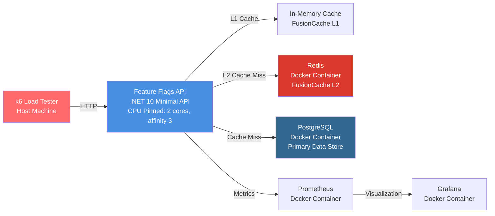
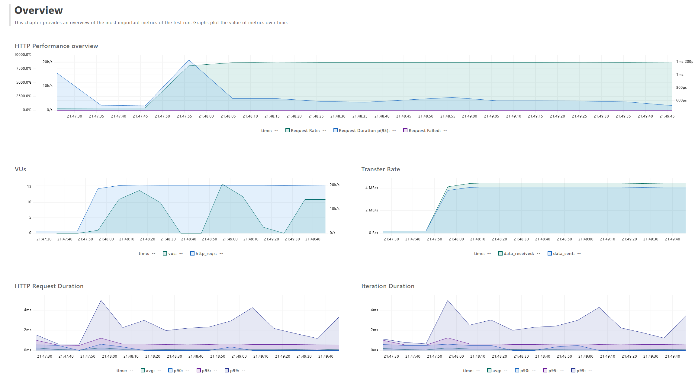
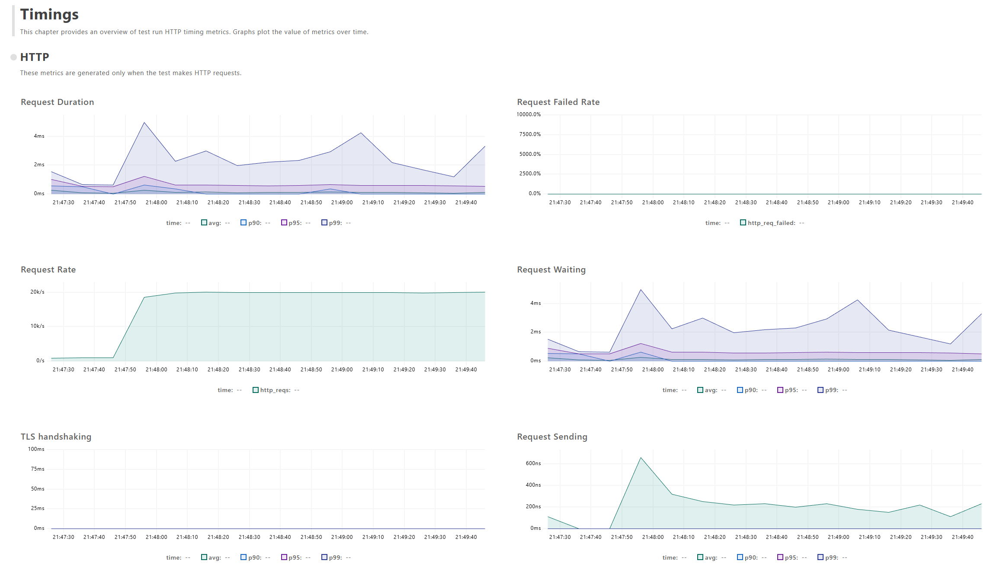
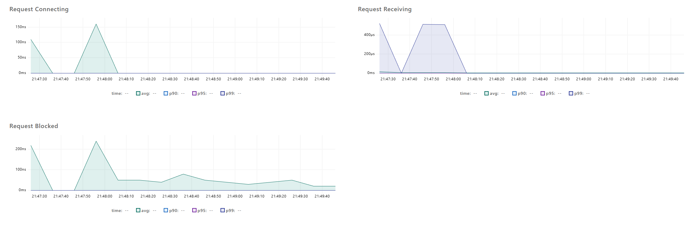
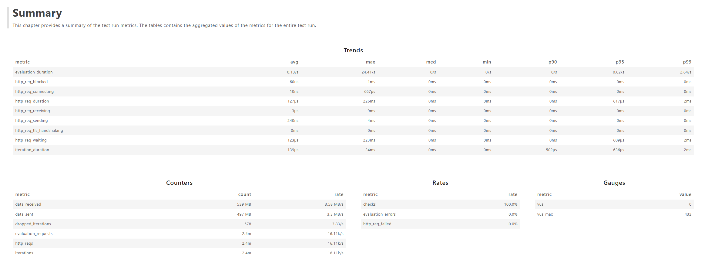
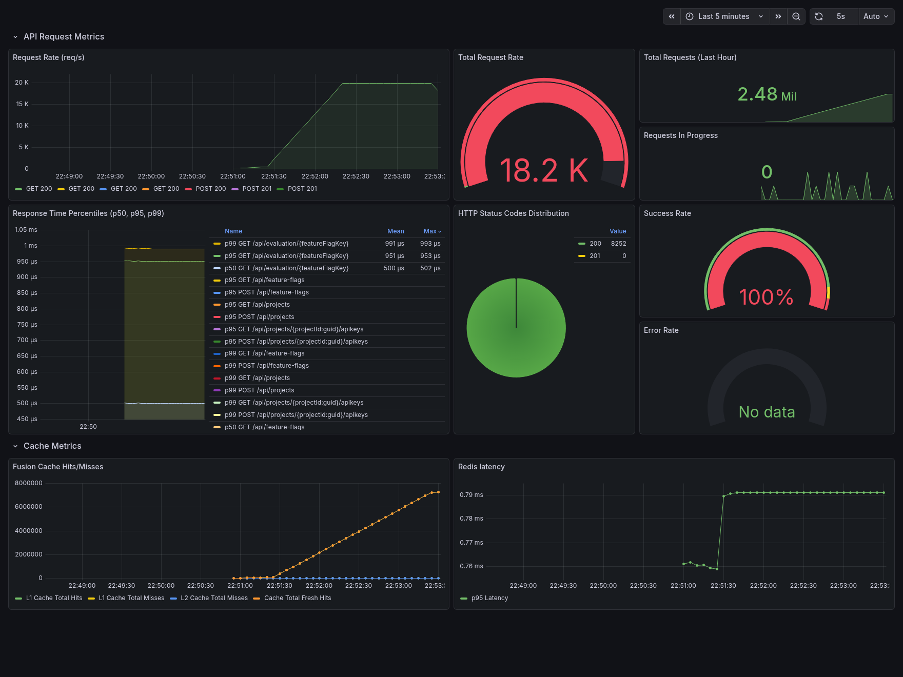
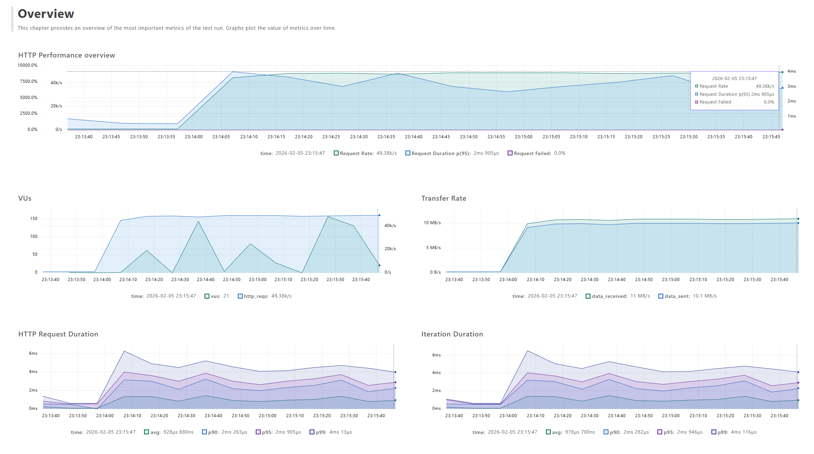
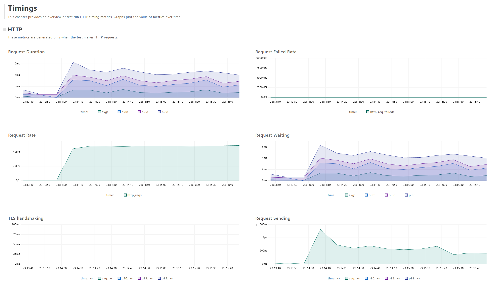
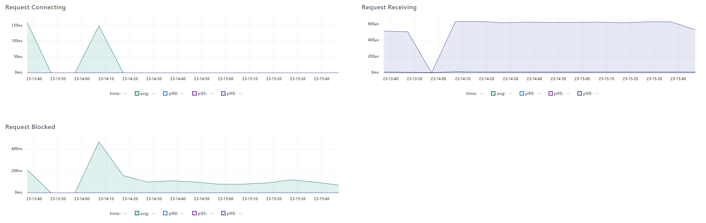

# Feature Flags API - Benchmark Documentation

## Stage 1: Local Host Benchmarks

### Overview

This document captures the performance characteristics of the Feature Flags API under controlled local conditions. Stage
1 benchmarks establish baseline performance metrics for cache-optimized hot-path evaluation before moving to distributed
cluster testing which will be Stage 2. This is a proof of concept and not intended for production use yet.

All benchmarks were conducted independently, meaning that after every test run, the environment was reset to its initial
state - including deleting all Docker containers and volumes, and rerunning the API and k6.

From the project's root directory (assuming PowerShell on Windows, and specific Docker compose Environment Variables),
the following commands were used to set up the environment and execute the benchmarks:

1. `docker compose -f .\infrastructure\compose.localhost.yaml up -d`
2. `$env:ASPNETCORE_ENVIRONMENT = "Production"`
3.
`$env:ConnectionStrings__FeatureFlagsDatabase = "Host=localhost;Port=5432;Database=feature_flags_db;Username=postgres;Password=password;"`
4. `$env:ConnectionStrings__FeatureFlagsCache = "localhost:6379"`
5. `$env:JwtSecretKey = “{some_long_string}”`
6. `$env:EnableDevToken= “true”`
7. `cmd /c "cd src\Web.Api && start /affinity 3 dotnet bin\Release\net10.0\Web.Api.dll"`
8. `$env:K6_WEB_DASHBOARD="true"`
9. `$env:K6_WEB_DASHBOARD_EXPORT="report.html"`
10. `k6 run --out json=summary.json infrastructure/k6.evaluation.steady.js`

## Target Performance:

1. p99 latency < 5 ms
2. Hot-path evaluation: sub-millisecond with cache hits
3. Sustained load: 20k–50k RPS with 2 cores pinned

## Local Host Test Environment Architecture



### Component Specifications

| Component             | Version             | Configuration                                                                                     | Location     |
|-----------------------|---------------------|---------------------------------------------------------------------------------------------------|--------------|
| **Feature Flags API** | `.NET 10 (Runtime)` | 2 CPU cores, affinity mask `3`<br/>Kestrel HTTP/1.1<br/>FusionCache enabled (L1 + L2 + Backplane) | Host Machine |
| **Redis**             | `8.4`               | Memory: `N/A`<br/>Persistence: `OFF`<br/>Rest found in `Web.Api/Program.cs`                       | Docker       |
| **PostgreSQL**        | `18.1`              | Shared buffers: `128 MB`<br/>Max connections: `100`<br/>Npgsql pool: `0-100` connections          | Docker       |
| **k6**                | `1.5`               | VUs: `50-150`<br/>Duration: 2m (+ 30s warmup)<br/>Target RPS: 20k–50k                             | Host Machine |
| **Prometheus**        | `3.9.1`             | Scrape interval: `15`s<br/>Retention: `N/A`                                                       | Docker       |
| **Grafana**           | `12.3.2`            | Dashboards: `1` configured                                                                        | Docker       |

### Network Configuration

- **API → Redis:** Docker bridge network, latency < 1ms
- **API → PostgreSQL:** Docker bridge network, latency < 1ms
- **k6 → API:** Localhost (127.0.0.1), no network overhead
- **API → Prometheus:** Docker bridge network, async push/pull

### Hardware Specifications

```
CPU: AMD Ryzen 9950X3D, 16 Cores, 4.3 GHz Base Speed
RAM: 64 GB DDR5, 6400 MHz
Disk: SSD, Samsung 9100 Pro, 4 TB
OS: Windows 11
Docker: 29.2.0
```

## Benchmark Metrics

### Test Parameters

| Parameter            | Value                   |
|:---------------------|:------------------------|
| Warmup Duration      | 30 seconds              |
| Measurement Duration | 2 minutes (120 seconds) |
| Target RPS           | 20,000 - 50,000         |
| Virtual Users (VUs)  | 50 - 150                |
| Test Scenario        | Hot-path evaluation     |
| Cache State          | Pre-warmed              |

## k6 End-to-End Metrics - 20,000 RPS

### HTTP Request Latency Distribution

| Metric | Value (ms) | Target | Status |
|:-------|:-----------|:-------|:-------|
| p90    | 0          | -      | ✓      |
| p95    | 0.536      | -      | ✓      |
| p99    | 1          | < 5 ms | ✓      |
| Max    | 172        | -      | -      |
| Mean   | 0.059      | -      | -      |

### Throughput & Load

| Metric              | Value     | Notes                  |
|:--------------------|:----------|:-----------------------|
| Total Requests      | 2,429,412 | Over 2-minute test     |
| Requests/sec (avg)  | 16,062    | Sustained throughput   |
| Requests/sec (peak) | 20,000    | Peak observed RPS      |
| Failed Requests     | 0 (0%)    | HTTP errors, timeouts  |
| Data Received       | 537 MB    | Total response payload |
| Data Sent           | 495 MB    | Total request payload  |

### k6 Report Screenshots


*Figure 1: k6 overview*


*Figure 2: k6 timings*


*Figure 3: k6 requests (timings continued)*


*Figure 4: k6 summary*

## Prometheus/Grafana Internal Metrics

### Cache Performance

| Metric                  | Value  | Notes                |
|:------------------------|:-------|:---------------------|
| L1 Cache Hit Rate       | 99.79% | In-memory cache hits |
| L2 Cache Hit Rate       | 0%     | Redis cache hits     |
| Combined Cache Hit Rate | 99.79% | (L1 + L2) / Total    |
| Cache Miss Rate         | 0.21%  | Requires DB query    |

### Feature Evaluation Performance

| Metric                    | Value  | Target           | Status |
|:--------------------------|:-------|:-----------------|:-------|
| Evaluation Duration (p50) | 500 µs | -                | -      |
| Evaluation Duration (p95) | 951 µs | -                | -      |
| Evaluation Duration (p99) | 991 µs | < 1000 µs (1 ms) | ✓      |
| Evaluations/sec           | 20,000 | Matches RPS      | ✓      |
| Hot-path Cache Hits       | 99.79% | > 95% ideal      | ✓      |

### Grafana Dashboard Screenshots


*Figure 5: Grafana dashboard*

## k6 End-to-End Metrics - 50,000 RPS

### HTTP Request Latency Distribution

| Metric | Value (ms) | Target | Status |
|:-------|:-----------|:-------|:-------|
| p90    | 0          | -      | ✓      |
| p95    | 3.2977     | -      | ✓      |
| p99    | 4.7023     | < 5 ms | ✓      |
| Max    | 181        | -      | -      |
| Mean   | 1          | -      | -      |

### Throughput & Load

| Metric              | Value   | Notes                  |
|:--------------------|:--------|:-----------------------|
| Total Requests      | 5870844 | Over 2-minute test     |
| Requests/sec (avg)  | 38,998  | Sustained throughput   |
| Requests/sec (peak) | 50,000  | Peak observed RPS      |
| Failed Requests     | 0 (0%)  | HTTP errors, timeouts  |
| Data Received       | 1.3 GB  | Total response payload |
| Data Sent           | 1.2 GB  | Total request payload  |

### k6 Report Screenshots


*Figure 6: k6 overview*


*Figure 7: k6 timings*


*Figure 8: k6 requests (timings continued)*


*Figure 9: k6 summary*

## Prometheus/Grafana Internal Metrics

### Cache Performance

| Metric                  | Value  | Notes                |
|:------------------------|:-------|:---------------------|
| L1 Cache Hit Rate       | 99.79% | In-memory cache hits |
| L2 Cache Hit Rate       | 0%     | Redis cache hits     |
| Combined Cache Hit Rate | 99.79% | (L1 + L2) / Total    |
| Cache Miss Rate         | 0.21%  | Requires DB query    |

### Feature Evaluation Performance

| Metric                    | Value   | Target           | Status |
|:--------------------------|:--------|:-----------------|:-------|
| Evaluation Duration (p50) | 501 µs  | -                | -      |
| Evaluation Duration (p95) | 952 µs  | -                | -      |
| Evaluation Duration (p99) | 1.01 ms | < 1000 µs (1 ms) | ✗      |
| Evaluations/sec           | 50,000  | Matches RPS      | ✓      |
| Hot-path Cache Hits       | 99.79%  | > 95% ideal      | ✓      |

### Grafana Dashboard Screenshots


*Figure 10: Grafana dashboard*

Benchmarks Conducted: 05/02/2026
Conducted By: Adiv Asif